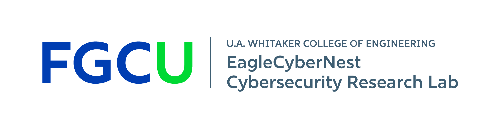
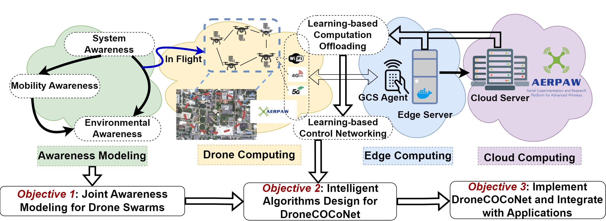
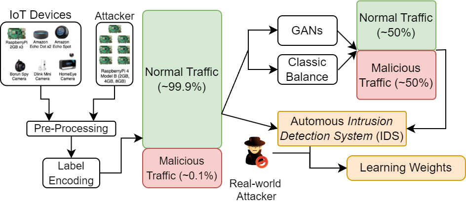
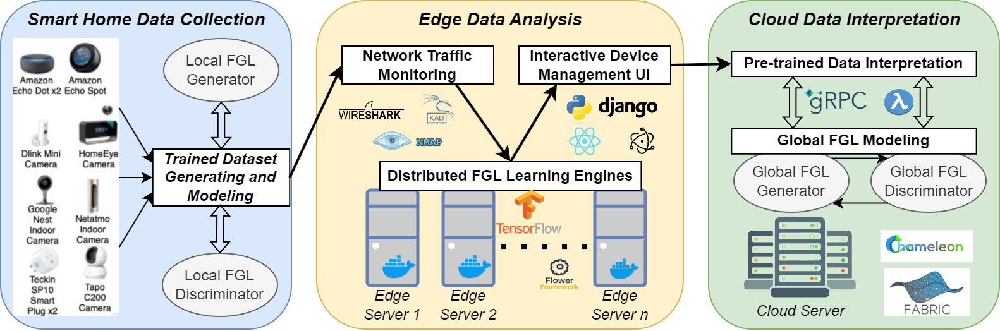
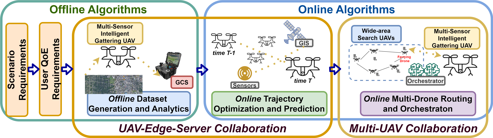



**Welcome to EagleCyberNest Cybersecurity Research Lab!**

---

Current Projects
=====

DroneCOCoNet: Learning-based Network-Edge Resource Orchestration of Heterogeneous Drones for Environmental Situational Awareness
-----

Heterogeneous drone swarms equipped with high-resolution sensors and cameras have a wide range of applications such as disaster response management, smart farming, and traffic control. However, to provide situational awareness of these applications, drone mobility modeling and intelligent scheduling of edge computation and networking resources are necessary. Currently, the orchestration of these resources is performed in isolation, which does not take into account factors such as the limited battery life of drones, which affects their geographical area coverage in application missions. Previous works that have utilized drone swarms in disaster response scenarios have: (a) only focused on computation offloading without considering factors that impact drone swarm communication, such as intermittent network link failures and environmental obstacles, and (b) not considered realistic emulation testbeds to evaluate related solutions.

To address these knowledge gaps, this research proposal aims to investigate a transformative co-design of heterogeneous drone-based environment modeling, learning-based computation offloading, and control networking to overcome various barriers in disaster response management scenarios. The research goal is to first develop ''awareness models'' for application environments, drone mobility, and trajectory optimization, which will then guide the creation of edge computation and networking resource orchestration algorithms in an intelligent and joint manner. The research objectives include developing joint awareness models for system, environment, and mobility, creating learning-based computation offloading and control networking algorithms, and implementing them in a framework called ''DroneCOCoNet'' to validate the integration benefits in drone-aided disaster response management applications deployed on realistic testbeds that feature rich datasets and industry-standard emulation platforms.

Generative Adversarial Networks (GANs) in IoT Data Security
---

Effective training in Machine Learning and Deep Learning models necessitates datasets that provide sufficient patterns and contextual information, particularly crucial in IoT networks. Imbalanced datasets, however, significantly challenge the performance of Autonomous Intrusion Detection Systems (IDS), leading to suboptimal detection rates for minority classes. In this research, we propose the use of various GAN models to generate synthetic data and balance the cybersecurity attack datasets, thereby enhancing the ability of the Autonomous IDS to detect and respond to various cyber-attacks. By employing various GAN models, we aim to enhance the representation of malicious traffic in training datasets. Our approach compares the effectiveness of GAN-augmented datasets against traditional data balancing techniques like SMOTE and Random Oversampling, demonstrating the potential of GANs to significantly improve IDS performance in detecting a wide range of cybersecurity attacks. 

Hierarchical Federated Generative Learning in Secured Smart Home System for Elderly
---

As the aging population continues to grow, there is an increasing reliance on smart home technologies to support the independence and well-being of elderly individuals. However, the rapid adoption of IoT devices in these settings has outpaced the implementation of adequate cybersecurity measures, leaving vulnerable communities exposed to significant risks. This research project seeks to establish a secure smart home environment for elderly and senior communities by addressing cybersecurity challenges associated with AI-driven smart home technologies. As IoT devices and sensors are increasingly used in smart homes to enhance seniors’ quality of life, these systems become more vulnerable to cyberattacks, potentially compromising sensitive information. By using a federated system like federated deep neural networks, encrypted models can be transmitted instead of sensitive training data full of important credentials. The project recognizes the lack of cybersecurity awareness among many elderly individuals and aims to develop a comprehensive cybersecurity education system and monitoring platform tailored specifically for this demographic. 

Deep Reinforcement Learning Strategy in Edge Video Analytics and Networking
---

This research explores the application of deep reinforcement learning (DRL) strategies in the optimization of edge video analytics and networking. Edge computing has become critical in managing real-time video data processing, particularly in environments where low latency and efficient resource allocation are essential. Traditional methods of handling video data at the edge often face challenges such as limited bandwidth, processing delays, and inefficient use of resources. By incorporating DRL, this work aims to address these challenges by enabling adaptive decision-making for tasks like video transmission, resource management, and task offloading in complex, dynamic environments. This approach is particularly relevant in scenarios such as smart cities, autonomous systems, and disaster response management, where real-time video data is vital for decision-making and system performance. The integration of DRL enhances the ability to dynamically adjust network parameters and resource distribution, leading to more efficient, scalable, and responsive video analytics at the edge.

---

Lab Members
=====

Sean Peppers (Undergraduate Student, FGCU), joined 2024.

Niel Patel (Undergraduate Student, FGCU), joined 2024, president of the FGCU Cybersecurity Club.

Kevin Kostage (Undergraduate Student, FGCU), joined 2023.

[Paulo Drefahl](https://www.paulodrefahl.com/) (Undergraduate Student, FGCU), joined 2023.

Former Lab Members
===

Chaise Ballotti, Undergraduate Student, FGCU.

Daniel De Sousa, Undergraduate Student, FGCU.

